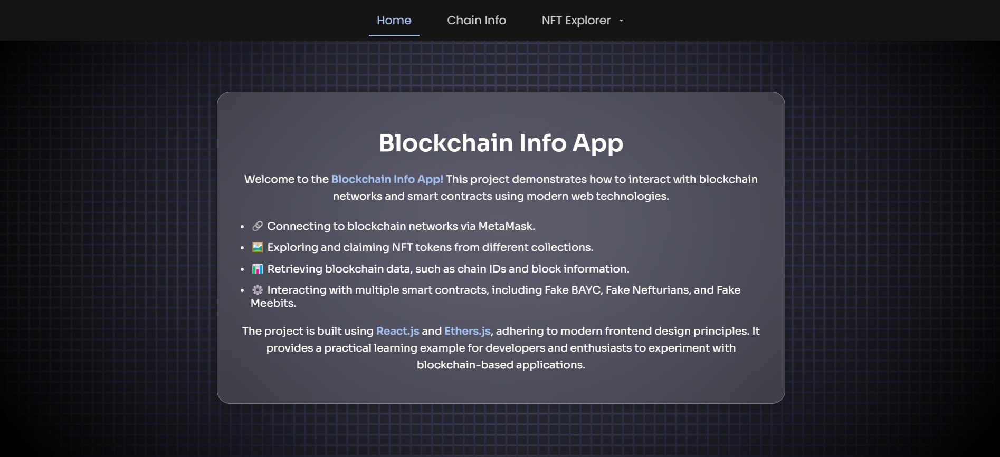

# ERC721-UX Project

This guide explains how to set up and run the **ERC721-UX Project**, a React-based decentralized application (dApp) for interacting with ERC721 tokens deployed on the **Holesky Testnet**. The application enables users to visualize and manipulate tokens from **Fake BAYC**, **Fake Nefturians**, and **Fake Meebits** contracts.

---

## Live Demo

**Live Demo**: [https://erc721-h6og9b7t9-kyllians-projects.vercel.app/](https://erc721-h6og9b7t9-kyllians-projects.vercel.app/)

---

## Screenshot



---

## Features and Objectives

1. **Connect to Holesky Network**  
   - Display ChainId, last block number, and connected wallet address.  
   - Redirect to an error page if the user is not on Holesky.

2. **Fake BAYC**  
   - View collection details: name and total supply.  
   - Claim a new token.  
   - View metadata (image and attributes) for a specific token ID.

3. **Fake Nefturians**  
   - View the minimum token price.  
   - Buy a new token (requires payment).  
   - View all tokens owned by a specific address with metadata.

4. **Fake Meebits**  
   - Select an unminted token ID.  
   - Use signature data to claim a token via **Fake Meebits Claimer**.

---

## Prerequisites

1. **Node.js and npm**  
   - Download and install Node.js: [Node.js Official Site](https://nodejs.org/).

2. **Metamask Wallet**  
   - Install Metamask: [Metamask Browser Extension](https://metamask.io/).  
   - Switch to the **Holesky Testnet** and ensure you have test ETH.

3. **Clone the Repository**  
   Use sparse checkout to clone only the required folder `erc721-ux` from your repository:  
   ```bash
   # Clone the repository with no checkout
   git clone --no-checkout https://github.com/KyllianGenot/Blockchain-Programming.git

   # Navigate to the repository
   cd Blockchain-Programming

   # Configure sparse checkout
   git sparse-checkout init --cone
   git sparse-checkout set erc721-ux

   # Pull the specified folder
   git checkout

   # Navigate to the project folder
   cd erc721-ux
   ```

---

## Project Structure

- **`public/`**: Static assets and images.  
- **`src/abi/`**: ABIs for interacting with the ERC721 contracts.  
- **`src/pages/`**: React pages:  
   - `/chain-info`: Displays blockchain details.  
   - `/fakeBayc`: Displays collection and minting functionality.  
   - `/fakeBayc/{tokenId}`: Token metadata details.  
   - `/fakeNefturians`: Buy tokens.  
   - `/fakeNefturians/{userAddress}`: Tokens owned by a user.  
   - `/fakeMeebits`: Mint tokens with signature-based functionality.  
- **`src/components/`**: Reusable components.  
- **`src/data/`**: Utility functions for smart contract interactions.  
- **`App.js`**: Main React file.

---

## Setting Up the Project

### 1. Install Dependencies

Run the following command in the project directory:  
```bash
npm install
```

---

### 2. Run the Application

Start the React development server:  
```bash
npm start
```

The application will be available at **[http://localhost:3000](http://localhost:3000)**.

---

## How It Works

### Chain Info Page (`/chain-info`)
- Connects to Metamask and fetches:
   - Chain ID  
   - Last block number  
   - Connected user address  
- Redirects to an error page if the user is not on Holesky.

---

### Fake BAYC

#### `/fakeBayc`
- Displays:
   - Collection name  
   - Total token count  
- Allows claiming a new token.

#### `/fakeBayc/{tokenId}`
- Fetches and displays metadata for a specific token.  
- Handles errors if the token does not exist.

---

### Fake Nefturians

#### `/fakeNefturians`
- Displays the minimum token price.  
- Button to purchase a token (requires payment).

#### `/fakeNefturians/{userAddress}`
- Displays all token IDs owned by the specified address with metadata.

---

### Fake Meebits

#### `/fakeMeebits`
- Allows users to:
   - Select an unminted token ID.  
   - Use signature data to claim a token via **Fake Meebits Claimer**.

---

## Deployment

To deploy your own version, run:  
```bash
vercel
```

---

## License

This project is licensed under the MIT License.

---

By following this guide, you can successfully set up and run the **ERC721-UX Project** locally or explore the deployed version. For questions or improvements, open an issue on the repository.
